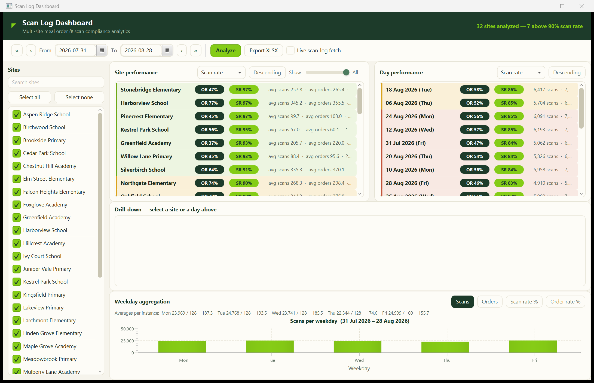

# Scan Log Dashboard

A JavaFX analytics dashboard for a school-catering operation: it aggregates **meal orders** and
**checkout scans** across dozens of sites and turns them into comparable performance metrics,
drill-downs, weekday patterns and Excel reports.

This is a portfolio rebuild of a production module I designed and built for a custom ERP system
at a catering company serving Berlin schools. The original ships inside a large proprietary
codebase; this version reproduces its full feature set as a standalone project — with a fresh
visual design and a **fully synthetic, deterministic data source** in place of the company's
database and backend APIs. No real company code, data or styling is included.



## The domain

Students order lunch (one of three menu lines, M1–M3) in advance. At lunchtime each meal handed
out is scanned. Two ratios tell the operations team where things go wrong:

| Metric | Formula | Meaning |
|---|---|---|
| **Order rate (OR)** | orders / (students x days) | Participation — how many enrolled students actually order |
| **Scan rate (SR)** | scans / orders | Compliance — how many ordered meals are actually scanned at handout |

A low scan rate means meals leave the counter unscanned (billing and food-waste risk); a low
order rate means a site under-uses the service. The dashboard surfaces both per site, per day,
per weekday, and per site-day.

## Features

- **Multi-site analysis** — checkbox selection with live search, select all / none
- **Date range navigation** — pickers plus one-click ±week / ±month shifting
- **Two aggregation paths**, mirroring the original architecture:
  - *Stored* — reads pre-aggregated day records (the fast "database" path)
  - *Live scan-log fetch* — replays the **raw scan event stream**: de-duplicates repeated
    scans per student and day, separates free-pass handouts (`FREE-0`), counts card scans and
    normalizes inconsistent menu tokens (`"Menu 1"`, `"menü1"`, `"M2"`, `"Special Veggie"`, ...)
    before counting
- **Async execution** — analyses run off the FX thread (`CompletableFuture`) with a live
  progress bar and per-site status label
- **Site performance list** — sortable by scan rate / order rate / name, ascending or
  descending, with a display-limit slider; every row shows OR/SR badges plus daily averages,
  color-coded by compliance status (good ≥ 90 %, warn ≥ 85 %, low < 85 %)
- **Day performance list** — the same metrics aggregated across sites per service day
- **Drill-down** — click a site to see its day-by-day detail, or click a day to see every
  site's numbers for that date (worst first)
- **Weekday aggregation chart** — bar chart toggleable between scans, orders, scan rate and
  order rate per weekday, with per-instance averages (e.g. spot structurally weak Fridays)
- **Excel export** — three-sheet XLSX workbook (site overview, day performance, full
  per-site/per-day details) via Apache POI

## Synthetic data

`SyntheticDataService` stands in for the ERP backend. All values derive from seeded random
generators keyed by site and date, so repeated analyses are reproducible — just like a real
datastore. The model includes:

- 32 sites with individual student counts, participation and compliance baselines
- weekday demand effects (Fridays are structurally weak) and day-to-day noise
- occasional scanner outages (compliance collapse) and shared holidays
- a deliberately noisy raw scan event stream: ~2 % duplicate scans, free-pass handouts,
  mixed menu token spellings and card vs. manual scans — so the live-path cleaning logic
  has real work to do

## Architecture

```
com.chordata.scandash
├── ScanDashApp / Launcher          JavaFX bootstrap (Launcher enables the shaded jar)
├── controller
│   └── DashboardController         View logic: selection, sorting, drill-down, chart, async flow
├── model                           Immutable domain types (records + summary classes)
│   ├── School, SchoolDayRecord, ScanEvent
│   ├── SchoolPerformanceSummary, DayPerformanceSummary, BreakdownItem
│   └── WeekdayAggregation, AggregationResult
└── service
    ├── SyntheticDataService        Deterministic stand-in for DB + order/scan-log APIs
    ├── AggregationService          Stored + live aggregation, dedup & token normalization
    └── ExcelExportService          Three-sheet XLSX export (Apache POI)
```

Compared to the production original (a single ~2,000-line controller), this rebuild separates
data access, aggregation and export into services and keeps the controller purely about view
logic — the refactoring I would apply to the original given the chance.

## Run it

### IntelliJ IDEA (recommended)

Open the project folder — IntelliJ imports the Maven project automatically. When prompted,
select any **JDK 21+** as the project SDK (or download one via
*Project Structure → SDKs → Add SDK → Download JDK*). Three shared run configurations are
included and appear in the run configuration dropdown:

| Configuration | What it does |
|---|---|
| **Dashboard (javafx:run)** | Builds and launches the app via the JavaFX Maven plugin |
| **Dashboard (direct)** | Runs the `Launcher` class straight from the IDE (fastest iteration) |
| **Package fat JAR** | Builds the self-contained `target/scan-log-dashboard-1.0.0.jar` |

### Command line

Requires JDK 21+. The Maven wrapper is included, so no Maven install is needed:

```bash
./mvnw javafx:run
```

Or build and run the self-contained fat jar:

```bash
./mvnw package
java -jar target/scan-log-dashboard-1.0.0.jar
```

The app opens with all sites selected and immediately runs a first analysis over the last four
weeks. Check **Live scan-log fetch** to run the raw-event path (slower, simulated API latency).

## Tech stack

- Java 21, JavaFX 21 (FXML + CSS)
- Apache POI (XLSX export)
- Maven (javafx-maven-plugin, shade plugin)

## License

[MIT](LICENSE)
